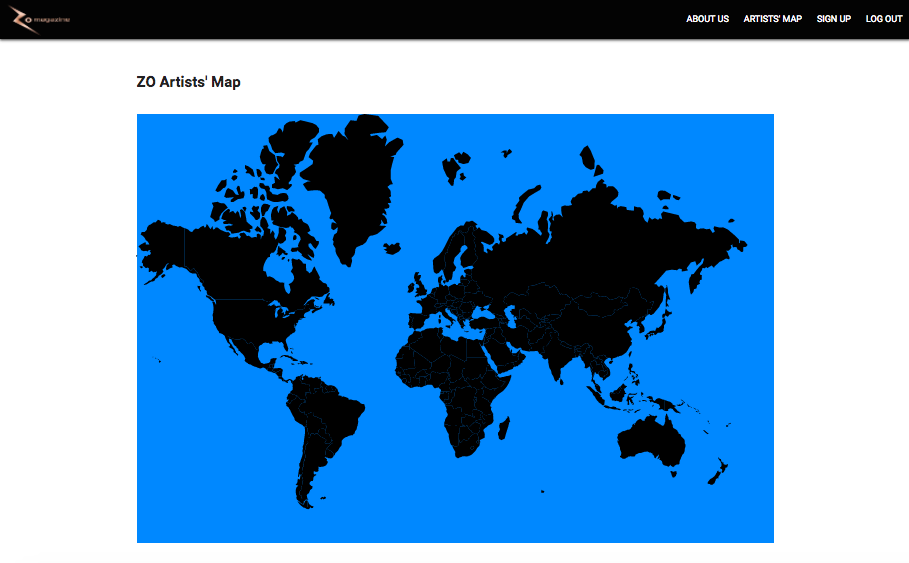

#ZO Map

This project is a map for ZO Magazine, a small online arts publication for which I'm currently doing some part-time work.

|Table of Contents|
|-----------------|
|[1. Links](#links)|
|[2. Technologies Used](#technologies)|
|[3. General Approach](#approach)|
|[4. Installation Instructions](#installation)|
|[5. Bugs](#bugs)|
|[6. Routes](#routes)|

##<a name="links">Links</a>

[Deployed App](https://zomap.herokuapp.com)  
[Github repo](https://github.com/winniecluk/zo-map)  
[Trello Board](https://trello.com/b/okLvJkw9/zo-map)

##<a name="technologies">Technologies Used</a>

* HTML5/CSS3/Javascript
* AngularJS 1.5
* RaphaëlJS

## <a name="approach">General Approach</a>

For my final project, I had several objectives:

* improve my git/github practices (**accomplished!**)
* create something simpler and less comprehensive so that I can focus on writing better code (**somewhat accomplished!**)
* bug fix on my own (**mostly accomplished!**)

##<a name="installation">Installation Instructions</a>
**Angular dependencies:** ui-router  
Instructions:  
1. Load source file in view.  
2. List ui-router as a dependency when instantiating app.  
3. Done  

**Node dependencies:** Express, CORS, dotenv, jsonwebtoken, mongoose, mongoose-bcrypt  
Instructions:  
1. In CLI, npm i express cors dotenv jsonwebtoken mongoose mongoose-bcrypt -S  
2. Require and use all your middleware in your server.js file  
3. Done

##<a name="bugs">Bugs</a>
|Bug/Hurdle|Fix|
|---|---|
|not sure how to assign own data to each country in map | discovered .data and wrote a for loop |
|Angular not realizing data had changed due to me writing native JS | discovered $scope.$apply|
|country names not displaying in correct order due to asynchronicity| sorted names on server side and resorted the country order when rendering on client side to match|
|render map function was being called only once in service, so map would not render again upon switching back to map view| ran to Jim at 11th hour |
|cannot use $scope.$apply in one case since Angular said $rootScope already in progress | haven't figured that one out yet |

##<a name="routes">Routes</a>
|URI|HTTP request|Use case|Auth Req?|
|---|------------|--------|---------|
|api/countries|GET|get the data for all the countries for map display|false|
|api/artists|GET|get the data for all the artists for admin to check|true|
|api/artists|PUT|approve the artist for map display|false|
|api/artists/reject|PUT|reject the artist|false|
|api/artists|POST|artist submit their information to the database, creating a new artist|false|
|api/artists|DELETE|empty database of all rejected artists|false|
|/login|GET|admin logs in|false|
